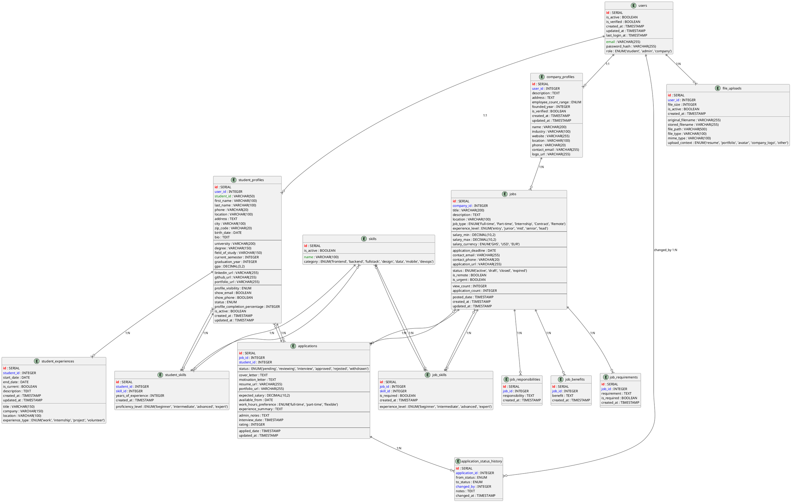

# IT Youth Talent Incubator - Backend API Documentation

## Overview
This document outlines the complete backend requirements for the IT Youth Talent Incubator platform - a comprehensive talent management system designed to connect Ghanaian IT students with employment opportunities. The platform serves three main user types: Students, Companies, and Administrators.

## Technology Stack Recommendations

### Backend Framework
- **Node.js with Express.js** (Primary recommendation)
- **Python with Django/FastAPI** (Alternative)
- **PHP with Laravel** (Alternative)

### Database
- **Primary**: PostgreSQL or MySQL for relational data
- **Document Storage**: MongoDB for flexible schema data (optional)
- **Cache**: Redis for sessions and caching

### Authentication
- JWT (JSON Web Tokens) for stateless authentication
- OAuth 2.0 for social login (optional)
- Bcrypt for password hashing

### File Storage
- Local file system or cloud storage (AWS S3, Google Cloud Storage)
- Support for PDF, DOC, DOCX, and image files

## Database Models

### Entity Relationship Diagram

For better visualization, PlantUML diagrams are available in separate files:
- **Detailed Database Schema**: [`database-schema.puml`](./database-schema.puml) - Complete database schema with all fields and constraints
- **Entity Relations Overview**: [`entity-relations.puml`](./entity-relations.puml) - Simplified view focusing on relationships



### 1. User Model
Base authentication model for all user types.

```sql
CREATE TABLE users (
    id SERIAL PRIMARY KEY,
    email VARCHAR(255) UNIQUE NOT NULL,
    password_hash VARCHAR(255) NOT NULL,
    role ENUM('student', 'admin', 'company') NOT NULL,
    is_active BOOLEAN DEFAULT true,
    is_verified BOOLEAN DEFAULT false,
    created_at TIMESTAMP DEFAULT CURRENT_TIMESTAMP,
    updated_at TIMESTAMP DEFAULT CURRENT_TIMESTAMP ON UPDATE CURRENT_TIMESTAMP,
    last_login_at TIMESTAMP
);
```

### 2. Student Profile Model
Extended profile information for student users.

```sql
CREATE TABLE student_profiles (
    id SERIAL PRIMARY KEY,
    user_id INTEGER REFERENCES users(id) ON DELETE CASCADE,
    student_id VARCHAR(50) UNIQUE,
    first_name VARCHAR(100) NOT NULL,
    last_name VARCHAR(100) NOT NULL,
    phone VARCHAR(20),
    location VARCHAR(100),
    address TEXT,
    city VARCHAR(100),
    zip_code VARCHAR(20),
    birth_date DATE,
    bio TEXT,
    
    -- Education Information
    university VARCHAR(200),
    degree VARCHAR(150),
    field_of_study VARCHAR(150),
    current_semester INTEGER,
    graduation_year INTEGER,
    gpa DECIMAL(3,2),
    
    -- Social Links
    linkedin_url VARCHAR(255),
    github_url VARCHAR(255),
    portfolio_url VARCHAR(255),
    
    -- Profile Settings
    profile_visibility ENUM('public', 'private') DEFAULT 'public',
    show_email BOOLEAN DEFAULT false,
    show_phone BOOLEAN DEFAULT false,
    
    -- Status
    status ENUM('active', 'job_seeking', 'employed', 'inactive') DEFAULT 'active',
    profile_completion_percentage INTEGER DEFAULT 0,
    is_active BOOLEAN DEFAULT true,
    
    created_at TIMESTAMP DEFAULT CURRENT_TIMESTAMP,
    updated_at TIMESTAMP DEFAULT CURRENT_TIMESTAMP ON UPDATE CURRENT_TIMESTAMP
);
```

### 3. Student Skills Model
Many-to-many relationship for student skills.

```sql
CREATE TABLE skills (
    id SERIAL PRIMARY KEY,
    name VARCHAR(100) UNIQUE NOT NULL,
    category ENUM('frontend', 'backend', 'fullstack', 'design', 'data', 'mobile', 'devops') NOT NULL,
    is_active BOOLEAN DEFAULT true
);

CREATE TABLE student_skills (
    id SERIAL PRIMARY KEY,
    student_id INTEGER REFERENCES student_profiles(id) ON DELETE CASCADE,
    skill_id INTEGER REFERENCES skills(id) ON DELETE CASCADE,
    proficiency_level ENUM('beginner', 'intermediate', 'advanced', 'expert') DEFAULT 'intermediate',
    years_of_experience INTEGER DEFAULT 0,
    created_at TIMESTAMP DEFAULT CURRENT_TIMESTAMP,
    UNIQUE(student_id, skill_id)
);
```

### 4. Student Experience Model
Work experience and projects for students.

```sql
CREATE TABLE student_experiences (
    id SERIAL PRIMARY KEY,
    student_id INTEGER REFERENCES student_profiles(id) ON DELETE CASCADE,
    title VARCHAR(150) NOT NULL,
    company VARCHAR(150),
    location VARCHAR(100),
    start_date DATE,
    end_date DATE,
    is_current BOOLEAN DEFAULT false,
    description TEXT,
    experience_type ENUM('work', 'internship', 'project', 'volunteer') DEFAULT 'work',
    created_at TIMESTAMP DEFAULT CURRENT_TIMESTAMP,
    updated_at TIMESTAMP DEFAULT CURRENT_TIMESTAMP ON UPDATE CURRENT_TIMESTAMP
);
```

### 5. Company Profile Model
Company information for job posting organizations.

```sql
CREATE TABLE company_profiles (
    id SERIAL PRIMARY KEY,
    user_id INTEGER REFERENCES users(id) ON DELETE CASCADE,
    name VARCHAR(200) NOT NULL,
    description TEXT,
    industry VARCHAR(100),
    website VARCHAR(255),
    location VARCHAR(100),
    address TEXT,
    phone VARCHAR(20),
    contact_email VARCHAR(255),
    logo_url VARCHAR(255),
    employee_count_range ENUM('1-10', '11-50', '51-200', '201-500', '500+'),
    founded_year INTEGER,
    is_verified BOOLEAN DEFAULT false,
    created_at TIMESTAMP DEFAULT CURRENT_TIMESTAMP,
    updated_at TIMESTAMP DEFAULT CURRENT_TIMESTAMP ON UPDATE CURRENT_TIMESTAMP
);
```

### 6. Job Posting Model
Core job posting information.

```sql
CREATE TABLE jobs (
    id SERIAL PRIMARY KEY,
    company_id INTEGER REFERENCES company_profiles(id) ON DELETE CASCADE,
    title VARCHAR(200) NOT NULL,
    description TEXT NOT NULL,
    location VARCHAR(100),
    job_type ENUM('Full-time', 'Part-time', 'Internship', 'Contract', 'Remote') NOT NULL,
    experience_level ENUM('entry', 'junior', 'mid', 'senior', 'lead') DEFAULT 'entry',
    
    -- Salary Information
    salary_min DECIMAL(10,2),
    salary_max DECIMAL(10,2),
    salary_currency ENUM('GHS', 'USD', 'EUR') DEFAULT 'GHS',
    
    -- Application Information
    application_deadline DATE,
    contact_email VARCHAR(255),
    contact_phone VARCHAR(20),
    application_url VARCHAR(255),
    
    -- Job Status
    status ENUM('active', 'draft', 'closed', 'expired') DEFAULT 'draft',
    is_remote BOOLEAN DEFAULT false,
    is_urgent BOOLEAN DEFAULT false,
    
    -- Metrics
    view_count INTEGER DEFAULT 0,
    application_count INTEGER DEFAULT 0,
    
    -- Timestamps
    posted_date TIMESTAMP,
    created_at TIMESTAMP DEFAULT CURRENT_TIMESTAMP,
    updated_at TIMESTAMP DEFAULT CURRENT_TIMESTAMP ON UPDATE CURRENT_TIMESTAMP
);
```

### 7. Job Requirements and Responsibilities
Flexible text fields for job details.

```sql
CREATE TABLE job_requirements (
    id SERIAL PRIMARY KEY,
    job_id INTEGER REFERENCES jobs(id) ON DELETE CASCADE,
    requirement TEXT NOT NULL,
    is_required BOOLEAN DEFAULT true,
    created_at TIMESTAMP DEFAULT CURRENT_TIMESTAMP
);

CREATE TABLE job_responsibilities (
    id SERIAL PRIMARY KEY,
    job_id INTEGER REFERENCES jobs(id) ON DELETE CASCADE,
    responsibility TEXT NOT NULL,
    created_at TIMESTAMP DEFAULT CURRENT_TIMESTAMP
);

CREATE TABLE job_benefits (
    id SERIAL PRIMARY KEY,
    job_id INTEGER REFERENCES jobs(id) ON DELETE CASCADE,
    benefit TEXT NOT NULL,
    created_at TIMESTAMP DEFAULT CURRENT_TIMESTAMP
);
```

### 8. Job Skills Requirements
Many-to-many relationship for required job skills.

```sql
CREATE TABLE job_skills (
    id SERIAL PRIMARY KEY,
    job_id INTEGER REFERENCES jobs(id) ON DELETE CASCADE,
    skill_id INTEGER REFERENCES skills(id) ON DELETE CASCADE,
    is_required BOOLEAN DEFAULT true,
    experience_level ENUM('beginner', 'intermediate', 'advanced', 'expert') DEFAULT 'intermediate',
    created_at TIMESTAMP DEFAULT CURRENT_TIMESTAMP,
    UNIQUE(job_id, skill_id)
);
```

### 9. Job Applications Model
Student applications to job postings.

```sql
CREATE TABLE applications (
    id SERIAL PRIMARY KEY,
    job_id INTEGER REFERENCES jobs(id) ON DELETE CASCADE,
    student_id INTEGER REFERENCES student_profiles(id) ON DELETE CASCADE,
    
    -- Application Status
    status ENUM('pending', 'reviewing', 'interview', 'approved', 'rejected', 'withdrawn') DEFAULT 'pending',
    
    -- Application Content
    cover_letter TEXT,
    motivation_letter TEXT,
    resume_url VARCHAR(255),
    portfolio_url VARCHAR(255),
    
    -- Additional Information
    expected_salary DECIMAL(10,2),
    available_from DATE,
    work_hours_preference ENUM('full-time', 'part-time', 'flexible'),
    experience_summary TEXT,
    
    -- Admin Notes
    admin_notes TEXT,
    interview_date TIMESTAMP,
    rating INTEGER CHECK (rating >= 1 AND rating <= 5),
    
    -- Timestamps
    applied_date TIMESTAMP DEFAULT CURRENT_TIMESTAMP,
    updated_at TIMESTAMP DEFAULT CURRENT_TIMESTAMP ON UPDATE CURRENT_TIMESTAMP,
    
    UNIQUE(job_id, student_id)
);
```

### 10. Application Status History
Track application status changes.

```sql
CREATE TABLE application_status_history (
    id SERIAL PRIMARY KEY,
    application_id INTEGER REFERENCES applications(id) ON DELETE CASCADE,
    from_status ENUM('pending', 'reviewing', 'interview', 'approved', 'rejected', 'withdrawn'),
    to_status ENUM('pending', 'reviewing', 'interview', 'approved', 'rejected', 'withdrawn') NOT NULL,
    changed_by INTEGER REFERENCES users(id),
    notes TEXT,
    changed_at TIMESTAMP DEFAULT CURRENT_TIMESTAMP
);
```

### 11. File Uploads Model
Manage file uploads (resumes, portfolios, etc.).

```sql
CREATE TABLE file_uploads (
    id SERIAL PRIMARY KEY,
    user_id INTEGER REFERENCES users(id) ON DELETE CASCADE,
    original_filename VARCHAR(255) NOT NULL,
    stored_filename VARCHAR(255) NOT NULL,
    file_path VARCHAR(500) NOT NULL,
    file_size INTEGER NOT NULL,
    file_type VARCHAR(100) NOT NULL,
    mime_type VARCHAR(100) NOT NULL,
    upload_context ENUM('resume', 'portfolio', 'avatar', 'company_logo', 'other') NOT NULL,
    is_active BOOLEAN DEFAULT true,
    created_at TIMESTAMP DEFAULT CURRENT_TIMESTAMP
);
```

## API Endpoints

### Base URL
```
Production: https://api.ityouthtalent.com/v1
Development: http://localhost:3000/api/v1
```

### Authentication Endpoints

#### POST /auth/register
Create a new user account.
```json
{
  "email": "student@university.edu.gh",
  "password": "securePassword123",
  "role": "student",
  "firstName": "Kwame",
  "lastName": "Asante"
}
```

**Response:**
```json
{
  "success": true,
  "data": {
    "user": {
      "id": 1,
      "email": "student@university.edu.gh",
      "role": "student",
      "isVerified": false
    },
    "token": "jwt.token.here",
    "expiresIn": 86400
  },
  "message": "Registration successful. Please verify your email."
}
```

#### POST /auth/login
Authenticate user and return access token.
```json
{
  "email": "student@university.edu.gh",
  "password": "securePassword123"
}
```

**Response:**
```json
{
  "success": true,
  "data": {
    "user": {
      "id": 1,
      "email": "student@university.edu.gh",
      "role": "student",
      "profile": {
        "firstName": "Kwame",
        "lastName": "Asante",
        "profileCompletion": 75
      }
    },
    "token": "jwt.token.here",
    "expiresIn": 86400
  }
}
```

#### POST /auth/logout
Invalidate current session.

#### GET /auth/me
Get current user information.

#### POST /auth/forgot-password
Request password reset.
```json
{
  "email": "student@university.edu.gh"
}
```

#### POST /auth/reset-password
Reset password with token.
```json
{
  "token": "reset.token.here",
  "newPassword": "newSecurePassword123"
}
```

### Student Endpoints

#### GET /student/profile
Get student profile information.

**Response:**
```json
{
  "success": true,
  "data": {
    "id": 1,
    "firstName": "Kwame",
    "lastName": "Asante",
    "email": "kwame.asante@student.ug.edu.gh",
    "phone": "+233 24 567 8900",
    "location": "Accra, Ghana",
    "bio": "Passionate computer science student...",
    "university": "University of Ghana",
    "degree": "Bachelor of Science",
    "fieldOfStudy": "Computer Science",
    "currentSemester": 6,
    "graduationYear": 2025,
    "gpa": 3.4,
    "skills": [
      {
        "name": "JavaScript",
        "proficiencyLevel": "advanced",
        "yearsOfExperience": 2
      }
    ],
    "experiences": [
      {
        "title": "Web Development Intern",
        "company": "TechStart Ghana",
        "startDate": "2024-06-01",
        "endDate": "2024-08-31",
        "description": "Developed responsive web applications..."
      }
    ],
    "profileCompletion": 85,
    "linkedinUrl": "https://linkedin.com/in/kwameasante",
    "githubUrl": "https://github.com/kwameasante",
    "portfolioUrl": "https://kwameasante.dev"
  }
}
```

#### PUT /student/profile
Update student profile.

#### GET /student/jobs
Get available jobs for students with filters.

**Query Parameters:**
- `page` (int): Page number (default: 1)
- `limit` (int): Items per page (default: 20)
- `location` (string): Filter by location
- `type` (string): Filter by job type
- `experience` (string): Filter by experience level
- `skills` (string[]): Filter by required skills
- `search` (string): Search in title and description

**Response:**
```json
{
  "success": true,
  "data": {
    "jobs": [
      {
        "id": 1,
        "title": "Frontend Developer",
        "company": {
          "name": "TechCorp Ghana",
          "logo": "https://example.com/logo.png"
        },
        "location": "Accra",
        "type": "Full-time",
        "salary": "GHS 8,000 - 12,000",
        "postedDate": "2024-01-15T10:00:00Z",
        "deadline": "2024-02-15T23:59:59Z",
        "description": "We are looking for a talented Frontend Developer...",
        "requirements": ["React", "JavaScript", "CSS", "Git"],
        "isRemote": false,
        "isUrgent": false,
        "applicationCount": 23,
        "viewCount": 156
      }
    ],
    "pagination": {
      "currentPage": 1,
      "totalPages": 5,
      "totalItems": 98,
      "itemsPerPage": 20
    },
    "filters": {
      "availableLocations": ["Accra", "Kumasi", "Tamale"],
      "availableTypes": ["Full-time", "Part-time", "Internship"],
      "experienceLevels": ["entry", "junior", "mid"]
    }
  }
}
```

#### GET /student/jobs/:id
Get detailed job information.

#### POST /student/jobs/:id/apply
Apply for a specific job.

```json
{
  "coverLetter": "I am excited to apply for this position...",
  "motivationLetter": "I am passionate about web development...",
  "expectedSalary": 10000,
  "availableFrom": "2024-03-01",
  "workHoursPreference": "full-time",
  "portfolioUrl": "https://myportfolio.com",
  "resumeFile": "base64EncodedFileOrFileId"
}
```

#### GET /student/applications
Get student's job applications.

**Response:**
```json
{
  "success": true,
  "data": {
    "applications": [
      {
        "id": 1,
        "job": {
          "id": 1,
          "title": "Frontend Developer",
          "company": "TechCorp Ghana"
        },
        "status": "pending",
        "appliedDate": "2024-01-20T10:00:00Z",
        "lastUpdated": "2024-01-20T10:00:00Z",
        "coverLetter": "I am excited to apply...",
        "expectedSalary": 10000
      }
    ],
    "statistics": {
      "total": 5,
      "pending": 2,
      "reviewing": 1,
      "interview": 1,
      "approved": 1,
      "rejected": 0,
      "successRate": 20
    }
  }
}
```

### Admin Endpoints

#### GET /admin/dashboard
Get admin dashboard statistics.

**Response:**
```json
{
  "success": true,
  "data": {
    "stats": {
      "totalStudents": 247,
      "totalJobs": 18,
      "totalApplications": 152,
      "pendingReviews": 23,
      "activeJobs": 15,
      "placementRate": 32
    },
    "recentApplications": [
      {
        "id": 1,
        "studentName": "Kwame Asante",
        "jobTitle": "Frontend Developer",
        "company": "TechCorp Ghana",
        "appliedDate": "2024-01-20T10:00:00Z",
        "status": "pending"
      }
    ],
    "activeJobs": [
      {
        "id": 1,
        "title": "Frontend Developer",
        "company": "TechCorp Ghana",
        "applicationCount": 23,
        "deadline": "2024-02-15T23:59:59Z"
      }
    ]
  }
}
```

#### GET /admin/students
Get students list with filters.

**Query Parameters:**
- `page`, `limit`: Pagination
- `status`: Filter by student status
- `university`: Filter by university
- `graduationYear`: Filter by graduation year
- `skills`: Filter by skills
- `search`: Search in name, email

#### GET /admin/students/:id
Get detailed student information.

#### PUT /admin/students/:id
Update student information (admin only).

#### DELETE /admin/students/:id
Deactivate student account.

#### GET /admin/jobs
Get all jobs for admin management.

#### POST /admin/jobs
Create new job posting.

```json
{
  "title": "Frontend Developer",
  "companyId": 1,
  "description": "We are looking for a talented developer...",
  "location": "Accra",
  "type": "Full-time",
  "experienceLevel": "junior",
  "salaryMin": 8000,
  "salaryMax": 12000,
  "salaryCurrency": "GHS",
  "applicationDeadline": "2024-02-15",
  "contactEmail": "hr@techcorp.com",
  "contactPhone": "+233 20 123 4567",
  "isRemote": false,
  "requirements": ["React", "JavaScript", "CSS"],
  "responsibilities": ["Develop user interfaces", "Write clean code"],
  "benefits": ["Health Insurance", "Learning Budget"]
}
```

#### PUT /admin/jobs/:id
Update existing job posting.

#### DELETE /admin/jobs/:id
Delete job posting.

#### GET /admin/applications
Get all applications with filters.

**Query Parameters:**
- `page`, `limit`: Pagination
- `status`: Filter by application status
- `jobId`: Filter by specific job
- `dateFrom`, `dateTo`: Filter by date range
- `search`: Search in student name, job title

#### PUT /admin/applications/:id/status
Update application status.

```json
{
  "status": "approved",
  "notes": "Excellent candidate, proceed with interview",
  "interviewDate": "2024-02-01T14:00:00Z"
}
```

### Company Endpoints

#### GET /company/profile
Get company profile.

#### PUT /company/profile
Update company profile.

#### GET /company/jobs
Get company's job postings.

#### POST /company/jobs
Create new job posting (requires admin approval).

#### GET /company/applications
Get applications for company jobs.

### Analytics Endpoints

#### GET /admin/analytics/overview
Get overview analytics.

**Response:**
```json
{
  "success": true,
  "data": {
    "overview": {
      "totalJobs": 45,
      "activeJobs": 28,
      "totalApplications": 234,
      "totalStudents": 156,
      "placementRate": 32,
      "avgTimeToHire": 18
    },
    "jobMetrics": {
      "byType": [
        {"type": "Full-time", "count": 18, "percentage": 64},
        {"type": "Part-time", "count": 8, "percentage": 29}
      ],
      "byLocation": [
        {"location": "Accra", "count": 23, "percentage": 51},
        {"location": "Kumasi", "count": 12, "percentage": 27}
      ]
    },
    "applicationTrends": [
      {"date": "2024-01-01", "applications": 12},
      {"date": "2024-01-02", "applications": 15}
    ]
  }
}
```

### File Upload Endpoints

#### POST /upload/file
Upload a file (resume, portfolio, etc.).

**Request:** Multipart form data
- `file`: File to upload
- `context`: Upload context (resume, portfolio, avatar, etc.)

**Response:**
```json
{
  "success": true,
  "data": {
    "fileId": 123,
    "originalFilename": "resume.pdf",
    "url": "https://storage.example.com/files/resume_123.pdf",
    "size": 245760,
    "type": "application/pdf"
  }
}
```

## Error Handling

### Standard Error Response Format
```json
{
  "success": false,
  "error": {
    "code": "VALIDATION_ERROR",
    "message": "Invalid input data",
    "details": {
      "field": "email",
      "message": "Email is required"
    }
  }
}
```

### HTTP Status Codes
- `200` - Success
- `201` - Created
- `400` - Bad Request (validation errors)
- `401` - Unauthorized (authentication required)
- `403` - Forbidden (insufficient permissions)
- `404` - Not Found
- `409` - Conflict (duplicate resource)
- `422` - Unprocessable Entity (validation failed)
- `500` - Internal Server Error

### Common Error Codes
- `VALIDATION_ERROR` - Input validation failed
- `AUTHENTICATION_REQUIRED` - Authentication token required
- `INVALID_CREDENTIALS` - Login credentials invalid
- `INSUFFICIENT_PERMISSIONS` - User lacks required permissions
- `RESOURCE_NOT_FOUND` - Requested resource doesn't exist
- `DUPLICATE_RESOURCE` - Resource already exists
- `FILE_TOO_LARGE` - Uploaded file exceeds size limit
- `INVALID_FILE_TYPE` - Uploaded file type not allowed

## Configuration Requirements

### Environment Variables
```env
# Database
DB_HOST=localhost
DB_PORT=5432
DB_NAME=it_youth_talent
DB_USER=app_user
DB_PASSWORD=secure_password

# JWT
JWT_SECRET=your-super-secure-jwt-secret
JWT_EXPIRES_IN=24h

# File Storage
UPLOAD_PATH=/uploads
MAX_FILE_SIZE=10MB
ALLOWED_FILE_TYPES=pdf,doc,docx,jpg,jpeg,png

# Email (for notifications)
SMTP_HOST=smtp.gmail.com
SMTP_PORT=587
SMTP_USER=noreply@ityouthtalent.com
SMTP_PASSWORD=email_password

# URLs
FRONTEND_URL=http://localhost:5173
API_URL=http://localhost:3000

# Features
ENABLE_EMAIL_VERIFICATION=true
ENABLE_PASSWORD_RESET=true
ENABLE_FILE_UPLOAD=true
```

## Security Considerations

### Authentication & Authorization
1. **JWT Tokens**: Implement secure JWT token handling with proper expiration
2. **Password Security**: Use bcrypt with minimum 12 rounds for password hashing
3. **Rate Limiting**: Implement rate limiting for API endpoints
4. **CORS**: Configure proper CORS settings for frontend domain
5. **Input Validation**: Validate and sanitize all input data
6. **SQL Injection**: Use parameterized queries or ORM
7. **File Upload Security**: Validate file types, sizes, and scan for malware

### Data Protection
1. **Sensitive Data**: Never store plain text passwords or sensitive information
2. **GDPR Compliance**: Implement data deletion and export features
3. **Audit Logging**: Log important actions for security monitoring
4. **Database Encryption**: Encrypt sensitive fields in database

## Performance Optimization

### Database
1. **Indexing**: Add appropriate indexes on frequently queried fields
2. **Query Optimization**: Use efficient queries and avoid N+1 problems
3. **Connection Pooling**: Implement database connection pooling
4. **Caching**: Use Redis for session storage and frequently accessed data

### API Performance
1. **Pagination**: Implement pagination for all list endpoints
2. **Response Compression**: Enable gzip compression
3. **Image Optimization**: Compress and resize uploaded images
4. **CDN**: Use CDN for file storage and static assets

## Deployment Recommendations

### Infrastructure
1. **Container Deployment**: Use Docker for containerization
2. **Load Balancing**: Implement load balancer for high availability
3. **SSL/TLS**: Use HTTPS with valid SSL certificates
4. **Database Backup**: Implement automated database backups
5. **Monitoring**: Set up application and infrastructure monitoring
6. **Logging**: Centralized logging system for debugging and monitoring

### CI/CD Pipeline
1. **Automated Testing**: Unit tests, integration tests, and API tests
2. **Code Quality**: ESLint, Prettier, and SonarQube for code quality
3. **Security Scanning**: Dependency vulnerability scanning
4. **Automated Deployment**: Deploy to staging and production environments

## Testing Strategy

### API Testing
1. **Unit Tests**: Test individual functions and methods
2. **Integration Tests**: Test API endpoints and database interactions
3. **Authentication Tests**: Test JWT token handling and permissions
4. **File Upload Tests**: Test file upload functionality and validation
5. **Performance Tests**: Load testing for high traffic scenarios

### Test Data
1. **Seed Data**: Create comprehensive seed data for development and testing
2. **Mock Data**: Generate realistic mock data for various scenarios
3. **Test Users**: Create test accounts for different user roles

## Notification System

### Email Templates
1. **Welcome Email**: New user registration confirmation
2. **Application Status**: Job application status updates
3. **Job Alerts**: New job postings matching student preferences
4. **Password Reset**: Secure password reset instructions
5. **Interview Notifications**: Interview scheduling and reminders

### Push Notifications (Future Enhancement)
1. **Real-time Updates**: Application status changes
2. **Job Recommendations**: Personalized job suggestions
3. **Deadline Reminders**: Application deadline notifications

## Future Enhancements

### Additional Features
1. **Chat System**: Real-time messaging between students and employers
2. **Video Interviews**: Integrated video interview functionality
3. **Skills Assessment**: Online technical skill assessments
4. **Job Matching Algorithm**: AI-powered job matching
5. **Company Reviews**: Student reviews and ratings for companies
6. **Event Management**: Career fairs and networking events
7. **Certificate Management**: Digital certificates for completed programs
8. **Analytics Dashboard**: Advanced reporting and analytics

### Scalability Improvements
1. **Microservices Architecture**: Break down monolith into microservices
2. **Message Queues**: Implement message queues for background processing
3. **Search Engine**: Elasticsearch for advanced search capabilities
4. **Real-time Features**: WebSocket support for real-time updates

---

This documentation provides a comprehensive foundation for building a robust backend system for the IT Youth Talent Incubator platform. Regular updates and maintenance of this documentation will be essential as the platform evolves and new features are added.